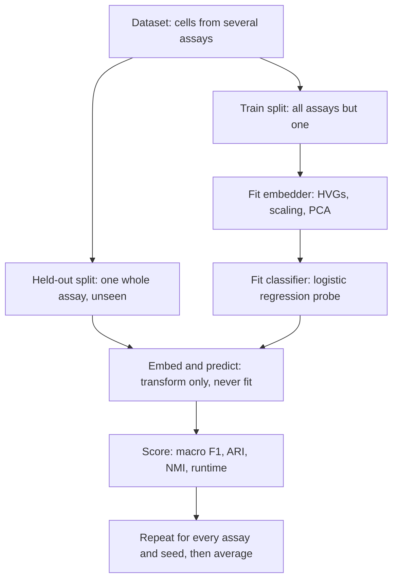
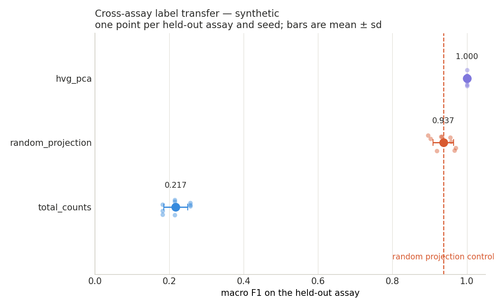
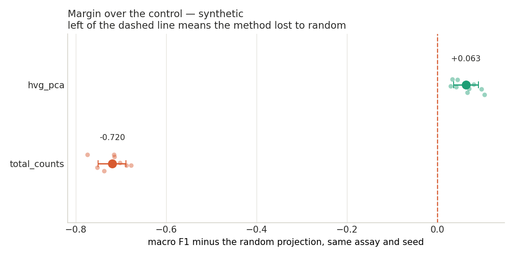
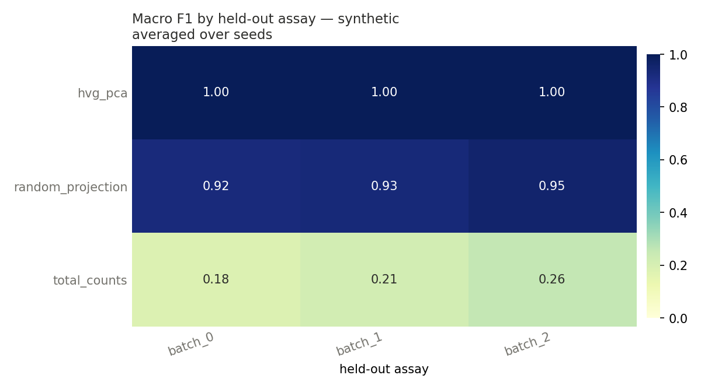
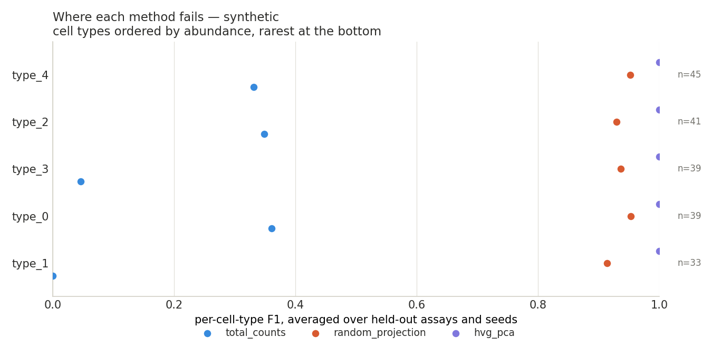
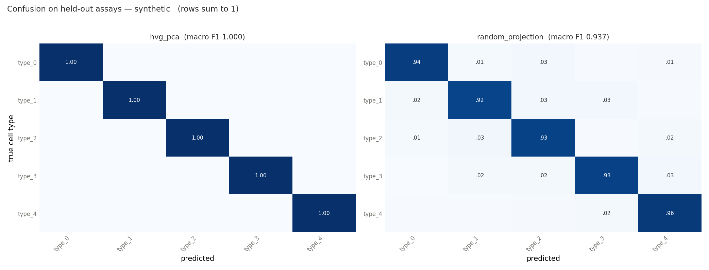
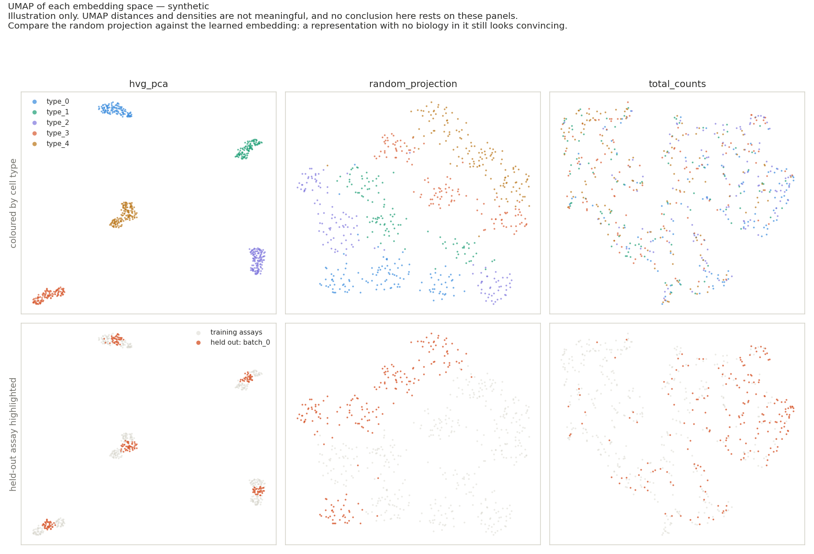

# scfm-benchmark

**Do single-cell foundation model embeddings transfer to an unseen batch better than a PCA baseline — and better than a random projection?**

Single-cell foundation models are pretrained on tens of millions of cells and released with strong claims about general-purpose cell representations. A parallel literature keeps finding that simple, parameter-free representations match or beat them on downstream tasks, and that evaluating these models is harder than it looks. Both things are reported honestly; the disagreement usually comes down to protocol.

This repository is one protocol, applied identically to every method, with two deliberately stupid controls included so the numbers stay interpretable.

> **Status: baselines complete, foundation models in progress.** The controls and the evaluation harness came first on purpose — a foundation model number is only meaningful next to a baseline measured the same way. See [Roadmap](#roadmap).

---

## The protocol



**Leave-one-batch-out label transfer.** For each batch in turn: fit the embedder on all *other* batches, fit a logistic regression cell-type classifier on those embeddings, then predict the held-out batch.

### Step by step

1. **Load counts.** Raw counts are pulled from `layers['counts']` rather than trusting whatever normalisation the file shipped with, so every method starts from the same place. Cell types with fewer than 20 cells are dropped — you cannot measure per-class F1 on three cells.
2. **Split by assay, not at random.** One sequencing technology is held out whole.
3. **Fit the embedder on training cells only.** Gene selection, scaling and the PCA rotation are all learned here and nowhere else.
4. **Transform both splits** with those frozen parameters.
5. **Fit a logistic regression** on the training embedding.
6. **Predict the held-out assay** and score it.
7. **Repeat** across every assay and three seeds, then aggregate mean and spread.

### Three choices that do the real work

**Nothing is fit on the held-out batch — including gene selection.** Selecting highly variable genes on the full matrix before splitting is a quiet leak: gene selection has then seen the test assay, and it inflates every method in the table by an amount nobody can recover afterwards. See `select_hvg` in `src/scfmbench/data.py`, which takes only the training matrix.

**Held-out batches are different technologies, not random cell splits.** A random 80/20 split over pooled cells leaves near-duplicate cells on both sides and measures close to nothing. Holding out an entire assay is the situation an actual user faces when they apply a published model to their own data.

**Macro F1 is the headline, not accuracy.** Cell type abundances are heavily skewed. A model that nails the two dominant types and fails on the other eleven can post excellent accuracy, which is precisely the failure mode worth catching.

### The controls

| Control | What it is | What it tells you |
|---|---|---|
| `random_projection` | Same preprocessing, then a random Gaussian linear map | Contains no learned biology. Anything that fails to beat it is not doing useful work. |
| `total_counts` | Two numbers per cell: log library size, log genes detected | If this scores well above chance, cell types in that dataset are partly separable by sequencing depth alone — worth knowing before interpreting anybody's benchmark. |

---

## Results

### Synthetic data (plumbing check, not a finding)

| embedder | macro-F1 | ± sd | balanced acc | ARI | NMI | dim |
|---|---|---|---|---|---|---|
| `hvg_pca` | **1.000** | 0.000 | 1.000 | 1.000 | 1.000 | 50 |
| `random_projection` | **0.937** | 0.028 | 0.937 | 0.956 | 0.949 | 50 |
| `total_counts` | **0.217** | 0.032 | 0.277 | 0.063 | 0.120 | 2 |



Read this as a wiring test only. The synthetic generator draws cell types from well-separated gamma programs, so the task is easy enough that a random projection reaches 0.94 — which is exactly why the control is here. Note how narrow the gap is between a learned representation and a random one. A benchmark reporting only the top row would look far more impressive than it deserves.



The margin plot makes the same point per fold rather than on average. `hvg_pca` wins by about 0.06 and wins in every fold, which is a consistent but small victory. `total_counts` loses by 0.72, confirming the synthetic cell types are not separable by sequencing depth alone — if they were, the generator would be leaking a shortcut and the dataset would be worthless as a check.



The per-assay grid is the one to watch on real data. A method can average respectably and still collapse on a single technology, and that collapse is the thing a practitioner needs to know about.

### Where methods fail, and what they confuse



Macro F1 is an average over this plot. A method can look respectable in aggregate while scoring near zero on every rare type — the failure mode that matters most when you are annotating a new dataset and the rare populations are the reason you sequenced it.



Confusion matrices for the best method and the control, row-normalised. The question is not only how often a method is right but what it reaches for when it is wrong: a model that confuses two closely related subtypes is in a different situation from one scattering errors uniformly.

### UMAP, and why it is here under protest



UMAP is the standard way to look at single-cell data and a poor way to argue about it. Distances between clusters carry no meaning, cluster density carries no meaning, and `n_neighbors` and `min_dist` can be tuned until almost any embedding looks well separated. No conclusion in this repository rests on these panels, and they are off by default — pass `--umap` to draw them.

They earn their place for one reason. Look at the middle column. That is a random Gaussian projection, a representation containing nothing learned from any data, and it still produces visible cell-type structure. Put it beside the learned embedding and the honest reading is that a convincing UMAP is weak evidence. The third column, two numbers per cell, is what an embedding with genuinely no signal looks like — which is a useful calibration for how bad a picture has to be before it looks bad.

### Human pancreas — *pending*

Target dataset below. Results will be committed with the full fold-level CSV, not just the summary, so anyone can recompute the aggregates.

---

## Getting the data

The first real dataset is the human pancreas benchmark from Luecken et al. 2022, the standard integration benchmark for exactly this question: roughly 16k cells across four sequencing technologies (inDrop, CEL-Seq2, Smart-Seq2, SMARTer) with curated cell type labels, so batch is confounded with assay in a realistic way.

Download `human_pancreas_norm_complexBatch.h5ad` from the Luecken et al. figshare collection ([10.6084/m9.figshare.12420968](https://doi.org/10.6084/m9.figshare.12420968)) into `data/`. Raw counts live in `layers['counts']`, the batch key is `tech` and the label key is `celltype`; the loader handles all three.

```bash
python -m scfmbench.run \
  --data data/human_pancreas_norm_complexBatch.h5ad \
  --batch-key tech --label-key celltype --name pancreas
```

---

## Install and run

```bash
git clone https://github.com/divyaa985/scfm-benchmark.git
cd scfm-benchmark
pip install -e ".[dev]"

pytest -q                              # tests, no download needed
python -m scfmbench.run --synthetic    # full pipeline in under a minute
```

Each run writes four tidy tables into `results/` — `<name>_folds.csv` (one row per fold and seed), `<name>_summary.csv`, `<name>_per_class.csv` (one row per cell type per fold) and `<name>_confusion.csv` — plus the figures above into `results/figures/`. Pass `--no-plots` to skip the figures, or `--umap` to add the UMAP panels, which are slow on large data.

Everything so far runs on CPU. The foundation model embedders will need a GPU for the forward pass but no training — a free Colab T4 is enough for a dataset this size.

---

## Adding an embedder

One class, two methods, one registry line. The harness handles splits, seeds, metrics, figures and reporting.

```python
class MyEmbedder:
    name = "my_embedder"

    def fit(self, x_train):      # cells x genes counts, training batches only
        return self

    def transform(self, x):      # -> (n_cells, embedding_dim)
        ...

REGISTRY["my_embedder"] = lambda seed: MyEmbedder()
```

---

## Layout

```
src/scfmbench/
  data.py        loading, leak-free preprocessing, synthetic generator
  embedders.py   the methods under test and the registry
  evaluate.py    leave-one-batch-out protocol and metrics
  plots.py       the figures, including the optional UMAP panels
  run.py         command line entry point
tests/           runs on CPU in seconds, no download
configs/         dataset definitions
results/         summaries, fold-level CSVs, figures
```

---

## Roadmap

- [x] Leave-one-batch-out harness, leak-free preprocessing, two controls
- [x] `hvg_pca` baseline, test suite, CI, figures
- [x] Per-cell-type F1, confusion matrices, UMAP panels
- [ ] Human pancreas results
- [ ] scVI baseline (trained per fold on training batches only)
- [ ] Geneformer zero-shot embeddings
- [ ] scGPT zero-shot embeddings
- [ ] Accuracy against wall-clock cost, once a method exists slow enough for the axis to mean something
- [ ] A second dataset with a different confounding structure
- [ ] Write-up of where foundation models do and do not earn their cost

---

## Limitations

Stated up front rather than discovered by a reader.

Zero-shot embedding extraction is not the only way to use these models, and fine-tuning may well change the ranking; that is a separate and more expensive experiment. Logistic regression is a deliberately weak probe, chosen so the score reflects the embedding rather than the classifier, which means these numbers are a lower bound on achievable accuracy. Cell type labels in public atlases are themselves model-derived in places, so "ground truth" is doing some work in that phrase. And results on four pancreas technologies do not generalise to every tissue — hence a second dataset on the roadmap.

## Licence

MIT.
